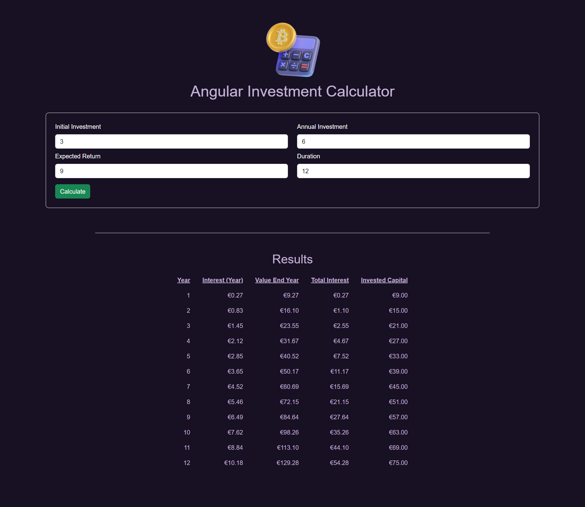

# Angular Investment Calculator Application

Project developed as a modular Angular application that calculates investment growth over time based on user inputs such as initial investment, annual contributions, expected return rate, and investment duration. Utilizing Angular 17’s standalone components and reactive Signals, the app provides a clean, scalable architecture with shared state management via a centralized service. The calculation logic is encapsulated in the UserService, which exposes reactive investment results accessible across components. The UI employs reactive bindings to display dynamic investment tables and supports clean separation of concerns. Styling leverages Bootstrap classes for responsiveness and modern design. This approach ensures maintainability, reactivity, and seamless data flow without heavy reliance on Input/Output event emitters.

